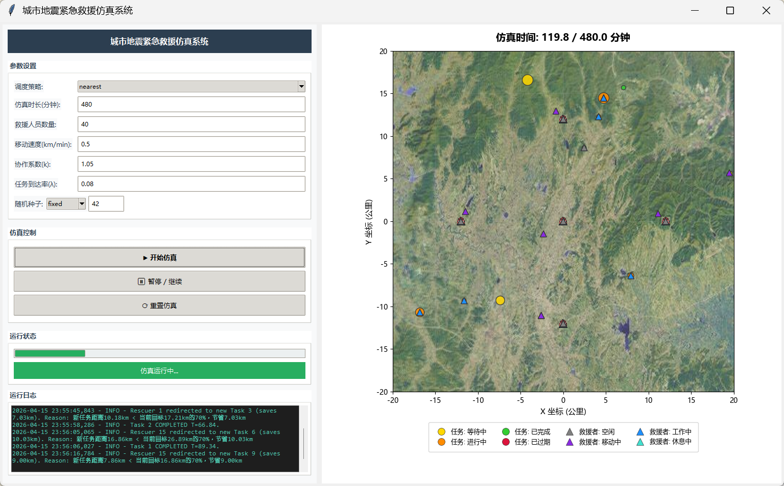

# 城市地震紧急救援仿真系统

[](https://www.python.org/)
[](https://pytorch.org/)
[](LICENSE)

> 一个基于离散事件驱动的城市地震紧急救援仿真框架，支持多种调度策略（基于规则与基于强化学习）以及可选的实时 Tkinter 图形界面。

----

## 目录

- [核心功能](#核心功能)
- [截图预览](#截图预览)
- [项目结构](#项目结构)
- [环境安装](#环境安装)
- [快速开始](#快速开始)
- [调度策略](#调度策略)
- [许可证](#许可证)

---

## 核心功能

- **离散事件仿真核心**：基于优先队列的事件驱动引擎，事件类型包括任务到达、救援者到达、任务完成等。
- **多类型救援者模型**：三种具有不同速度、工作效率、技能和疲劳机制的原型：
  - **医疗组**：响应快，工作效率中等。
  - **工程队**：速度慢但力量大，操作重型机械。
  - **搜救与后勤**：速度最快，耐力最佳。
- **动态灾情任务模型**：任务按规模分为 `small`、`medium`、`large`、`extra_large`，具有：
  - 随时间衰减的紧急度（线性或指数衰减）。
  - 基于角色槽位的协作需求。
  - 以人 · 分钟为单位的工作量。
- **调度策略**：
  - `nearest`：贪心距离最小化。
  - `urgent`：基于灾情规模的贪心优先级调度。
  - `hybrid`：综合距离、紧急度和工作量的加权评分。
  - `dqn`：单智能体深度 Q 网络。
  - `qmix`：多智能体 QMIX。
- **实时图形界面**：基于 Tkinter + Matplotlib 的可视化，展示城市地图、救援站、救援者和任务分布。

---

## 截图预览

**仿真系统页面**：

<div align="center">
  
</div>

---

## 项目结构

```
.
├── main.py              # 入口文件：命令行参数解析、种子固定、训练循环
├── simulator.py         # 离散事件仿真核心
├── tasks.py             # 灾情任务模型与紧急度衰减逻辑
├── rescuers.py          # 救援者模型、技能与疲劳机制
├── schedulers.py        # 调度器基类与调度策略封装
├── single_agent.py      # DQNAgent 实现
├── multi_agent.py       # QMIXAgent 实现
├── visualization.py     # Tkinter + Matplotlib 实时图形界面
├── requirements.txt     
├── pic/                 # 静态资源（地图、救援站图标）
│   ├── map.jpg
│   └── station.jpg
├── checkpoints/         # 强化学习模型参数权重
└── README.md           
```

---

## 环境安装

1. **克隆仓库**

```bash
git clone https://github.com/Ltx-Leif/urban-emergency-rescue-simulation.git
cd urban-emergency-rescue-simulation
```

2. **创建虚拟环境（推荐）**

```bash
conda create -n urbanSim python=3.10
conda activate urbanSim
```

3. **安装依赖**

```bash
pip install -r requirements.txt
```

> **PyTorch 安装说明**：`requirements.txt` 中固定了核心依赖包版本。如果你需要特定的 CUDA 版本或在其他平台上运行，请按照 [PyTorch 官方指南](https://pytorch.org/get-started/locally/) 手动安装。

---

## 快速开始

### 1. 命令行仿真

使用 `nearest` 策略运行基础仿真：

```bash
python main.py --strategy nearest
```

自定义任务到达率和救援者数量：

```bash
python main.py --strategy urgent --num_rescuers 50 --lambda_rate 0.12 --time 480
```

### 2. 启动图形界面

```bash
python main.py --gui
```

也可以设置固定种子以获得可复现的可视化效果：

```bash
python main.py --gui --seed_choice fixed --seed_value 42
```

### 3. 训练强化学习智能体

训练 DQN 智能体 500 轮：

```bash
python main.py --strategy dqn --train_episodes 500
```

训练 QMIX 多智能体：

```bash
python main.py --strategy qmix --train_episodes 500
```

### 4. 评估已训练模型

```bash
python main.py --strategy dqn --load_model_path checkpoints/dqn_final_trained_ep500.pth --eval_mode
```

------

## 调度策略

| 策略 | 类型 | 说明 |
| --- | --- | --- |
| `nearest` | 基于规则 | 为空闲救援者分配距离最近的可用任务。 |
| `urgent` | 基于规则 | 按灾情规模降序贪心选择任务（extra_large > large > medium > small），同规模下选距离近的。非抢占式。 |
| `hybrid` | 基于规则 | 将距离、紧急度和工作量综合为单一加权评分。 |
| `dqn` | 基于强化学习 | 单智能体深度 Q 网络，从状态向量中学习任务选择策略。 |
| `qmix` | 基于强化学习 | 多智能体 QMIX，通过集中式混合网络与分散式策略协调所有救援者。 |

你可以通过编辑 `main.py` 来调整仿真参数：

- **`DEFAULT_SCALE_CONFIG`**：调整各任务规模的紧急度范围、衰减率和工作量范围。
- **`DEFAULT_RESCUER_TYPES`**：修改救援者原型（速度、工作效率、疲劳阈值、人数配比）。
- **`max_rescuers_map`**：修改每个任务规模可同时派遣的救援者人数上限。

如需进行强化学习研究，可通过命令行参数或在 `single_agent.py` / `multi_agent.py` 中直接调整参数。

----

## 许可证

本项目基于 [MIT License](LICENSE) 开源，你可以自由学习、修改和分发。

```
MIT License

Copyright (c) 2026 Tianxiang Li

Permission is hereby granted, free of charge, to any person obtaining a copy
of this software and associated documentation files (the "Software"), to deal
in the Software without restriction, including without limitation the rights
to use, copy, modify, merge, publish, distribute, sublicense, and/or sell
copies of the Software, and to permit persons to whom the Software is
furnished to do so, subject to the following conditions:

The above copyright notice and this permission notice shall be included in all
copies or substantial portions of the Software.
```

---

> 如果你在学习过程中有任何问题，欢迎提交 [Issue](https://github.com/[YourUsername]/MusicPlayer4/issues) 或 [Pull Request](https://github.com/[YourUsername]/MusicPlayer4/pulls)。祝你学习愉快！
>
> ⭐ 如果这个项目对你有帮助，欢迎 Star 支持！